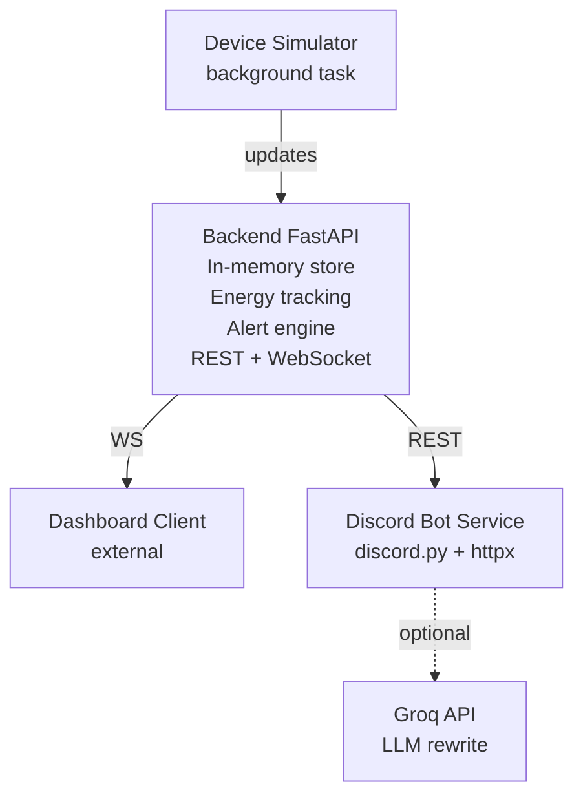

# Lights, Fans, Discord — Office Device Monitoring Platform

[](https://python.org)
[](https://fastapi.tiangolo.com)
[](LICENSE)

Real-time monitoring system for 15 simulated office devices (fans + lights) across 3 rooms. A single **FastAPI backend** serves as the single source of truth, streamed live to a **web dashboard** via WebSocket and queried on demand by a **Discord bot** via REST.

Built for **Techathon Nationals & Rover Summit — Preliminary Round**.

---

## Features

- **Live device simulation** — 15 devices (6 fans, 9 lights) in 3 rooms with random on/off toggling every few seconds
- **Real-time WebSocket push** — dashboard receives state changes instantly without polling
- **Energy tracking** — per-device kWh accumulation, resets daily
- **Smart alerts** — detects devices left on after hours (9AM–5PM) or rooms running continuously for >2 hours
- **Manual override** — toggle any device on/off via REST API for demos
- **Configurable** — tick interval, office hours, and alert thresholds via environment variables

---

## Architecture



Both clients read from the **same backend** — neither holds its own copy of state.

---

## Getting Started

### Prerequisites

- Python 3.11+
- pip

## Backend Setup

### Install Backend

```bash
cd backend
pip install -r requirements.txt
```

### Run Backend

```bash
cd backend
python -m uvicorn main:app --reload
```

The backend starts at `http://127.0.0.1:8000`. The simulator runs automatically and updates device states every 5 seconds.

## Discord Bot Setup

Create a Discord application/bot and get a bot token from the Discord Developer Portal.

### Install Discord Bot

```bash
cd discord-bot
pip install -r requirements.txt
```

### Configure Discord Bot

Create `discord-bot/.env` with:

```env
DISCORD_BOT_TOKEN=your_discord_bot_token
BACKEND_BASE_URL=http://127.0.0.1:8000
ALERT_POLL_SECONDS=30
GROQ_API_KEY=optional_groq_api_key
```

### Run Discord Bot

```bash
cd discord-bot
python -m app.bot
```

The bot queries the same backend API used by the dashboard.

### Discord Bot Commands

- `!status` shows an office-wide status summary
- `!room drawing|work1|work2` shows room-specific status
- `!usage` shows current total power and today's estimated usage

The bot expects these backend endpoints:

- `GET /devices`
- `GET /rooms/{room_name}`
- `GET /usage`
- `GET /alerts`

---

## API Reference

### REST Endpoints

| Method | Path | Description |
|--------|------|-------------|
| `GET` | `/` | Health check |
| `GET` | `/devices` | All 15 devices |
| `GET` | `/rooms/{room}` | Devices in a room (`drawing`, `work1`, `work2`) |
| `GET` | `/usage` | Current wattage + accumulated kWh (total and per-room) |
| `GET` | `/alerts` | Active alerts |
| `POST` | `/devices/{id}/toggle` | Toggle a device on/off |

### Example

```bash
# List all devices
curl http://127.0.0.1:8000/devices

# Get usage stats
curl http://127.0.0.1:8000/usage

# Toggle a fan
curl -X POST http://127.0.0.1:8000/devices/drawing-fan-1/toggle
```

### WebSocket

```
ws://127.0.0.1:8000/ws/devices
```

On connect, the server sends the full device state. Subsequent messages are pushed automatically every simulator tick.

**Message format:**

```json
{
  "type": "state_update",
  "devices": [{ "id": "work1-fan-1", "is_on": true, "current_power_w": 60, ... }],
  "usage": { "total_watts_now": 135, "total_kwh_today": 0.42, "per_room": { ... } },
  "alerts": [{ "type": "after_hours", "room": "work2", "message": "...", "active": true }]
}
```

---

## Configuration

All settings are configurable via environment variables with the `OFFICE_` prefix:

| Variable | Default | Description |
|----------|---------|-------------|
| `OFFICE_SIMULATOR_TICK_INTERVAL` | `5.0` | Seconds between simulator ticks |
| `OFFICE_ALERT_AFTER_HOURS_START` | `9` | Office hours start (hour) |
| `OFFICE_ALERT_AFTER_HOURS_END` | `17` | Office hours end (hour) |
| `OFFICE_CONTINUOUS_ON_THRESHOLD_HOURS` | `2.0` | Hours before "continuous on" alert fires |

```bash
# Example: faster simulation with shorter alert threshold
OFFICE_SIMULATOR_TICK_INTERVAL=3 OFFICE_CONTINUOUS_ON_THRESHOLD_HOURS=1 python -m uvicorn main:app
```

---

## Data Model

### Device

```json
{
  "id": "work1-fan-1",
  "type": "fan",
  "room": "work1",
  "label": "Fan 1 (Work Room 1)",
  "is_on": false,
  "rated_power_w": 60,
  "current_power_w": 0,
  "total_energy_kwh_today": 0.0,
  "last_changed": "2026-07-04T14:32:00Z",
  "on_since": null
}
```

Fans consume 60W, lights consume 15W. `current_power_w` equals rated power when on, 0 when off.

### Alert

```json
{
  "id": "alert-001",
  "type": "after_hours",
  "room": "work2",
  "message": "Devices in work2 are on after office hours.",
  "triggered_at": "2026-07-04T22:00:00Z",
  "active": true
}
```

---

## Project Structure

```
├── backend/
│   ├── .env.example          # Example backend environment variables
│   ├── main.py               # FastAPI app, lifespan, CORS, WebSocket endpoint
│   ├── config.py             # Settings from environment variables
│   ├── store.py              # In-memory store (15 devices + alerts)
│   ├── requirements.txt
│   ├── models/
│   │   ├── device.py         # Device model + enums
│   │   ├── alert.py          # Alert model + enums
│   │   └── schemas.py        # Response schemas
│   ├── simulator/
│   │   ├── engine.py         # Background simulator loop
│   │   └── alerts.py         # Alert evaluation logic
│   └── api/
│       ├── routes.py         # REST endpoints
│       └── ws.py             # WebSocket connection manager
├── markdowns/
│   ├── ARCHITECTURE.md       # System architecture documentation
│   ├── PROBLEM_STATEMENT.md  # Original competition problem statement
│   └── project_architecture.md
├── Diagrams/                 # System diagram + circuit schematic
├── discord-bot/
│   ├── .env.example          # Example bot environment variables
│   ├── app/
│   │   ├── bot.py            # Discord commands and message formatting
│   │   ├── bot_client.py     # Async HTTP client for backend endpoints
│   │   └── config.py         # Bot settings from environment variables
│   ├── requirements.txt
│   └── README.md
└── README.md
```

---

## Testing via Swagger UI

Start the server and open `http://127.0.0.1:8000/docs` — FastAPI generates an interactive API docs page where you can test every endpoint directly in the browser.

### WebSocket Test

Open your browser console (F12) and paste:

```js
const ws = new WebSocket("ws://127.0.0.1:8000/ws/devices");
ws.onmessage = (e) => console.log(JSON.parse(e.data));
// You'll see state updates arrive every ~5 seconds
```

Or using Python:

```bash
pip install websockets
```

```python
import asyncio, json, websockets

async def test():
    async with websockets.connect("ws://127.0.0.1:8000/ws/devices") as ws:
        msg = await asyncio.wait_for(ws.recv(), timeout=5)
        data = json.loads(msg)
        print(f"{data['type']} — {len(data['devices'])} devices, {sum(1 for d in data['devices'] if d['is_on'])} on")

asyncio.run(test())
```

---

## License

MIT
